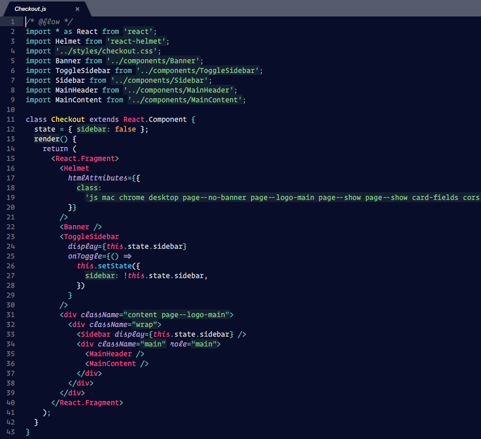

# Wonder Ocean

Oceanic Next but more wonderful



## How to install

Clone this repository in to your sublime packages, here is on Mac

```bash
cd ~/Library/Application\ Support/Sublime\ Text\ 3/Packages/
git clone https://github.com/aligos/wonder-ocean.git
```

After that activate this color-scheme using, add this setting to your
sublime-setting.

```json
{
  "color_scheme": "Packages/wonder-ocean/WonderOcean.tmTheme"
}
```

## References

* Theme is inspired by
  [Oceanic Next Color Scheme](https://github.com/voronianski/oceanic-next-color-scheme)
  &
  [Candyman Color Scheme from Naomi Plugin](https://github.com/borela/naomi/blob/master/Candyman.tmTheme)
* [Dan Abramov](https://twitter.com/dan_abramov) Oceanic Next Color Scheme he
  use at at JSConf Iceland 2018
  [Beyond React 16](https://reactjs.org/blog/2018/03/01/sneak-peek-beyond-react-16.html)

> **ocean** "images can be reminded of all the things going on"

By [Hermansyah Ocean](https://www.instagram.com/hermansyah_ocean/)
